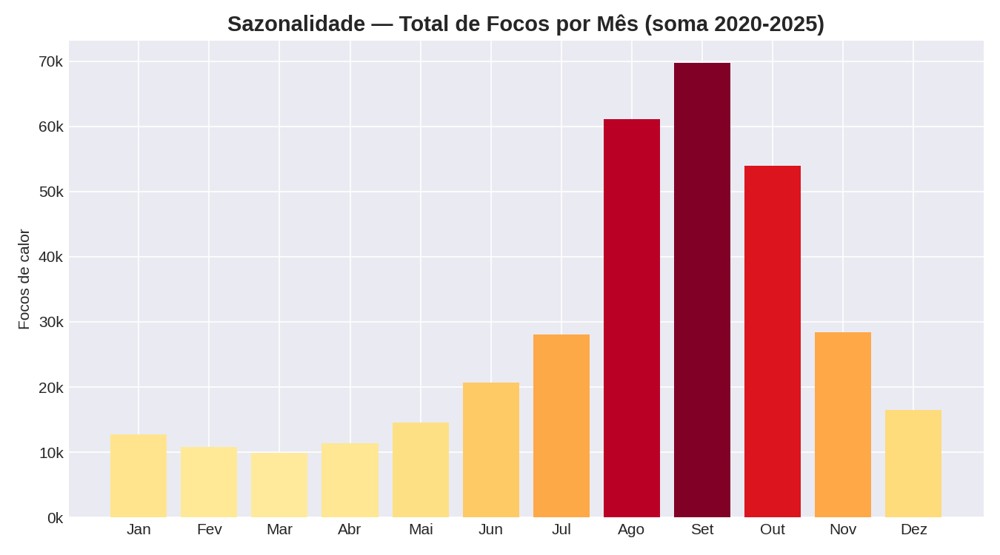
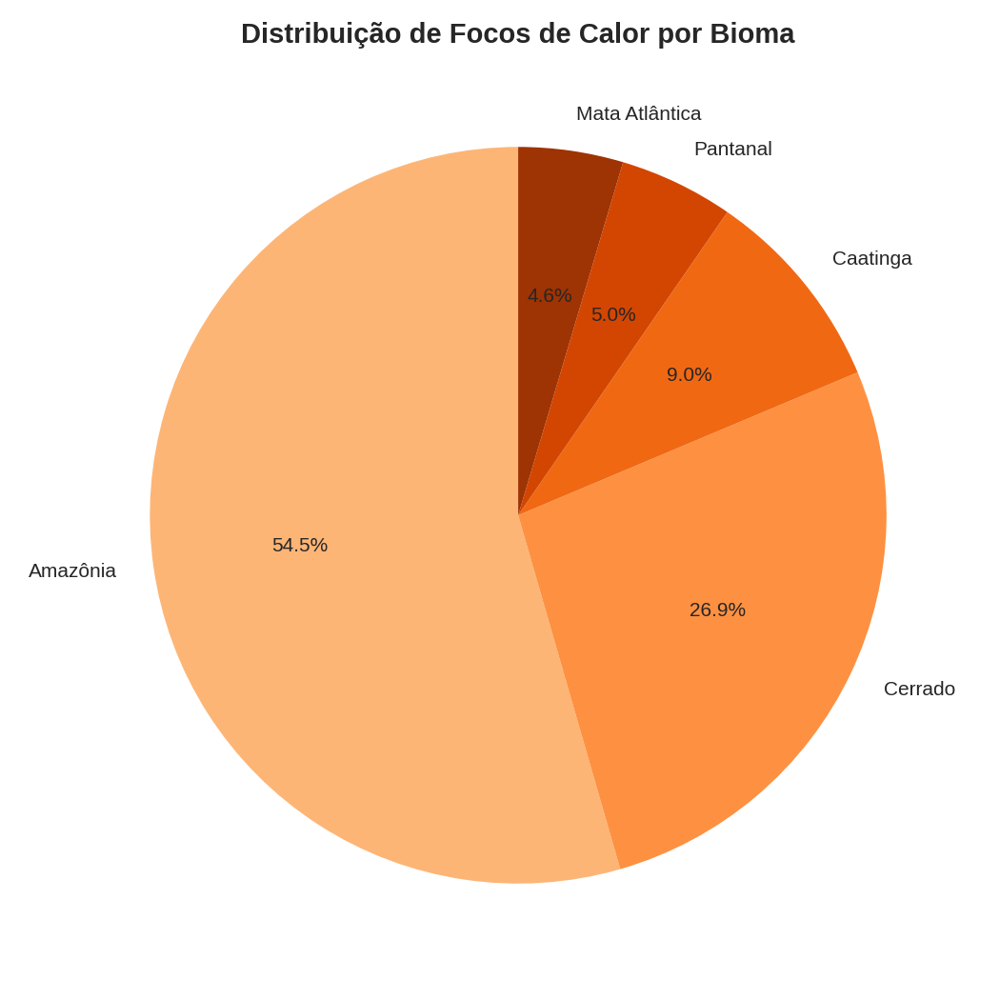

# 🔥 Análise do Índice de Queimadas no Brasil — Python (Pandas, NumPy & Matplotlib)

Projeto de análise exploratória de dados (EDA) sobre focos de queimadas no
Brasil entre 2020 e 2025, por estado, bioma e mês. Criado para praticar e
demonstrar habilidades de manipulação, agregação e visualização de dados
com foco em um tema ambiental relevante.

> ⚠️ **Sobre os dados:** este projeto usa um dataset **sintético**, construído
> a partir dos padrões sazonais e geográficos reais divulgados publicamente
> pelo Programa Queimadas do INPE (concentração em Amazônia/Cerrado, pico
> entre agosto e outubro, recorde em 2024). Não são dados oficiais. Para os
> dados reais, consulte o [Portal do INPE](https://queimadas.dgi.inpe.br/queimadas/portal).

## 🎯 Objetivo

Responder perguntas como:
- Como o número de focos de calor evoluiu ao longo dos anos?
- Quais estados concentram mais queimadas?
- Qual a distribuição por bioma (Amazônia, Cerrado, Mata Atlântica etc.)?
- Existe um padrão sazonal claro ao longo do ano?
- Quais meses podem ser classificados como "críticos" estatisticamente?

## 🛠️ Tecnologias utilizadas

- **Python 3**
- **Pandas** — leitura, agregação e agrupamento dos dados
- **NumPy** — média, desvio padrão e cálculo de z-score para detecção de meses críticos
- **Matplotlib** — visualizações (série temporal, barras, pizza)

## 📁 Estrutura do projeto

```
analise-queimadas-brasil/
├── data/
│   └── queimadas_brasil.csv       # dataset (gerado sinteticamente)
├── images/                        # gráficos gerados pela análise
│   ├── serie_temporal_focos.png
│   ├── focos_por_ano.png
│   ├── focos_por_bioma.png
│   ├── top_estados.png
│   └── sazonalidade_mensal.png
├── src/
│   ├── gerar_dados.py             # script que gera o dataset sintético
│   └── analise.py                 # script principal da análise
├── requirements.txt
└── README.md
```

## ▶️ Como executar

```bash
# 1. Clone o repositório
git clone https://github.com/guilhermecdev/analise-queimadas-brasil.git
cd analise-queimadas-brasil

# 2. Instale as dependências
pip install -r requirements.txt

# 3. (opcional) gere um novo dataset sintético
python src/gerar_dados.py

# 4. Rode a análise
python src/analise.py
```

Os gráficos serão salvos automaticamente na pasta `images/`.

## 📈 Principais insights encontrados

- **2024** se destaca como o ano com maior número de focos de calor do período — consistente com a seca histórica registrada naquele ano no país.
- Há um padrão sazonal muito claro: os focos disparam entre **agosto e outubro** (fim da estação seca) e caem drasticamente no primeiro trimestre do ano.
- **Pará** e **Mato Grosso** concentram os maiores volumes de focos entre os estados analisados.
- **Amazônia** e **Cerrado** juntos respondem pela grande maioria dos focos de calor registrados.
- A análise de z-score identificou meses estatisticamente "críticos" (mais de 1,5 desvios-padrão acima da média), todos concentrados em agosto-outubro dos anos de seca mais intensa.

## 📊 Exemplo de visualização




## 👤 Autor

**Guilherme Cardozo de Andrade**
Em transição de carreira para Analista de Dados
🔗 [LinkedIn](https://linkedin.com/in/guilhermecardozodev) · [GitHub](https://github.com/guilhermecdev)

## 📄 Licença

Este projeto está sob a licença MIT — sinta-se livre para usar como referência de estudo.
